# Golang RPG Textbox

This is a "simple" library / cli application to generate animated and static RPG style text boxes from a theme and text.

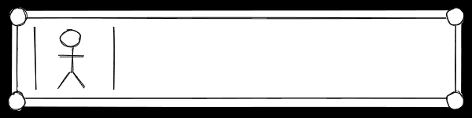

The library uses:
* https://github.com/arran4/golang-frame for the frame, which subdivides an image into 9 parts, and uses that
  to draw the frame. The content is repeated or stretched to match.
* https://github.com/arran4/golang-rpg-textbox for the text wrapping, most options can be passed into the 
  wrapper

In order to use this library you will need:
* To know what font you will be using
* To have your own theme

# Usage

## Requirement: A theme

You need to setup a theme, that can can be done using something that adheres to the interfaces (found `theme/interface.go`):
```
type Theme interface {
	Chevron() image.Image
	Avatar() image.Image
	FontFace() font.Face
	FontDrawer() *font.Drawer
}

type Frame interface {
	Frame() image.Image
	FrameCenter() image.Rectangle
}
```

Where frame is defined by the requirements for: https://github.com/arran4/golang-frame

For an example implementation of a theme checkout the contents of the `theme/*/` directories.

## Using the library

First off you need to construct the `*TextBox` object:
```go
tb, err := rpgtextbox.NewSimpleTextBox(theme, text, image.Pt(width, height), ops...)
```

Ops will be discussed later.

There are 2 ways of using the library, one for animations and one for just the frame.

### Just the frame:

To just generate the frame, you call the function `DrawNextPageFrame` on a `*TextBox` object.

```go
            tb, err := rpgtextbox.NewSimpleTextBox(theme, text, image.Pt(width, height), ops...)
                if err != nil {
                log.Panicf("Error %s", err)
            }
			i := image.NewRGBA(image.Rect(0, 0, *width, *height))
			if _, err := tb.DrawNextPageFrame(i); err != nil {
				log.Panicf("Draw next frame error: %s", err)
			}
			if err := util.SavePngFile(i, "out.png"); err != nil {
				log.Panicf("Error with saving file: %s", err)
			}
			log.Printf("Saving %s", ofn)

```

The core function is:
```go
func (tb *TextBox) DrawNextPageFrame(target wordwrap.Image, opts ...wordwrap.DrawOption) (bool, error)
```

The `target` is where it will draw the image. It will attempt to consume all the space available, so if you need
it to only target a smaller portion of it, be sure to use the `SubImage` function like so:
```go
offset := image.Pt(344,100)
target.SubImage(image.Rect(0, 0, *width, *height).Add(offset)).(wordwrap.Image)
```

This will just generate one frame, the first page. Each time you call the function it will produce the next
page of data. (Ie the next text box / speech dialog.)

### An animation

You can also use it to generate an animation, this can be wrapped up in your harness any way you like.

`DrawNextFrame` works very similar to the `DrawNextPageFrame` function except that it also returns a `WaitTime` and a `UserInput`.

`WaitTime` is the time before the next animation frame.

`UserInput` is if the animation has finished and that you should call the next frame generation to ensure smooth 
rendering. However, you do not need to, you can call in any sequence.

In order for `DrawNextFrame` to work you must specify an animation, see the option section below for a list. Or
read the code directly.

Example:
```go
            ops = some options and an animation option
            tb, err := rpgtextbox.NewSimpleTextBox(theme, text, image.Pt(width, height), ops...)
            if err != nil {
                log.Panicf("Error %s", err)
            }
            for {
                i := image.NewRGBA(image.Rect(0, 0, width, height))
                if done, ui, w, err := tb.rtb.DrawNextFrame(i); err != nil {
                    log.Panicf("Draw next frame error: %s", err)
                } else if done && !ui && w <= 0 {
					// The whole thing is done and there is no input
                    break
                } else if ui {
					// We are awaiting user input
                    break
                } else {
                    if w <= 0 {
                        w = time.Second / 2
                    }
                    f++
                    if ui && w <= 0 {
                        page++
                    }
                    log.Printf("%s: Adding frame %d for page %d", tb.Filename, f, page)
                    bounds := i.Bounds()
                    palettedImage := image.NewPaletted(bounds, palette.Plan9)
                    draw.Draw(palettedImage, palettedImage.Rect, i, bounds.Min, draw.Over)
                    gifo.Image = append(gifo.Image, palettedImage) // add the image to a gif
                    gifo.Delay = append(gifo.Delay, int(w/(time.Second/100))) // add the wait time too
                }
            }
            log.Printf("Saving %s", ofn)
            if err := util.SaveGifFile(ofn, gifo); err != nil {
                log.Panicf("Error with saving file: %s", err)
            }
            log.Printf("Saved %s", ofn)
```

## Use it as CLI application

Download it from the releases tab, or compile it yourself using Go. Once you have built it you can run `rpgtextbox` with
the following flags:

```text
rpgtextbox.exe:
  -animation string
    	Use help for list
  -avatar-pos string
    	Use help for list
  -avatar-scale string
    	Use help for list
  -chevron string
    	Use help for list
  -dpi float
    	Doc dpi (default 75)
  -font string
    	Text font (default "goregular")
  -height int
    	Doc height (default 150)
  -out string
    	Prefix of filename to output (default "out-")
  -size float
    	font size (default 16)
  -text string
    	File in, or - for std input
  -themedir string
    	Directory to find the theme (default "./theme")
  -width int
    	Doc width (default 600)
```

If the arguments are successful it will create the contents in location/filename specified in `out-prefix`.

# Options

There are a bunch of options, options are used in the following way:

```go
    tb, err := rpgtextbox.NewSimpleTextBox(theme, text, image.Pt(width, height), rpgtextbox.LeftAvatar, rpgtextbox.CenterAvatar)
    if err != nil {
        log.Panicf("Error %s", err)
    }
```

## Chevron Location Options

| Option | Example Image |
| --- | --- |
| `rpgtextbox.CenterBottomInsideTextFrame` | 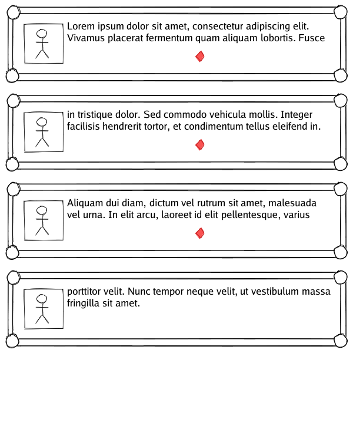 |
| `rpgtextbox.CenterBottomInsideFrame` | 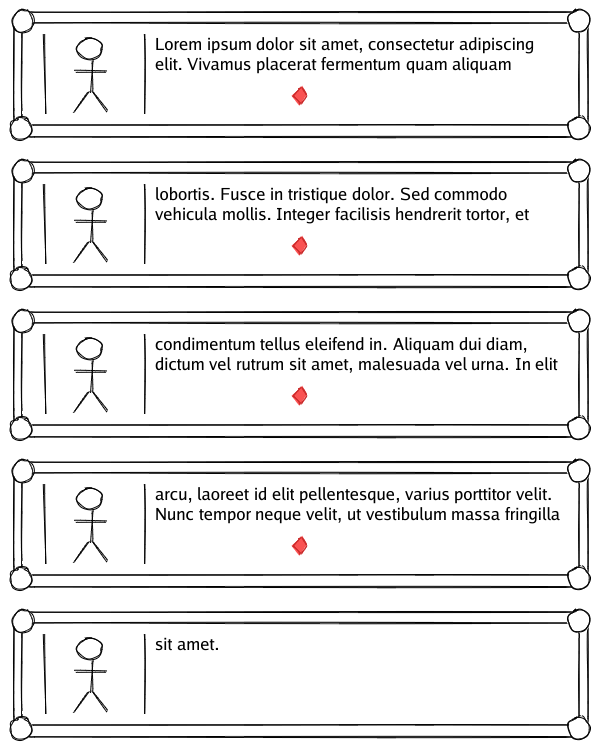 |
| `rpgtextbox.CenterBottomOnFrameTextFrame` | 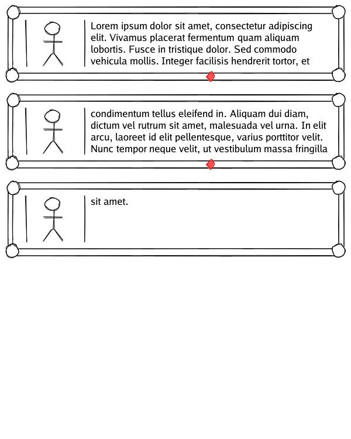 |
| `rpgtextbox.CenterBottomOnFrameFrame` | 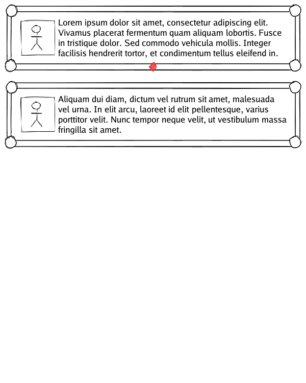 |
| `rpgtextbox.RightBottomInsideTextFrame` | 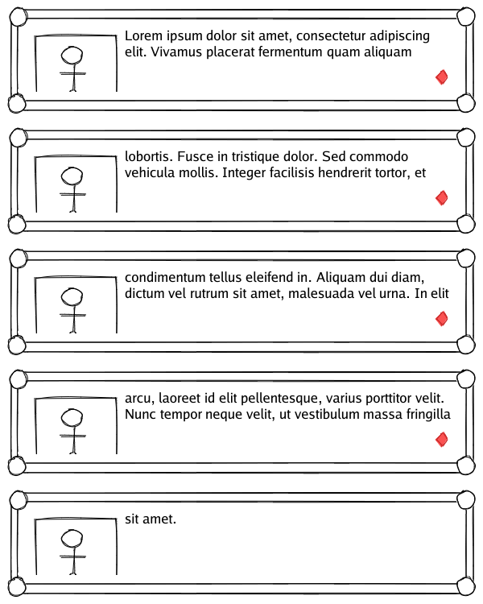 |
| `rpgtextbox.RightBottomInsideFrame` | 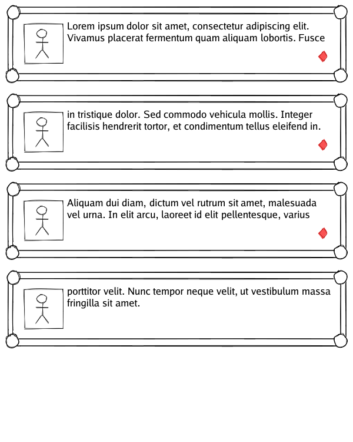 |
| `rpgtextbox.RightBottomOnFrameTextFrame` |  |
| `rpgtextbox.RightBottomOnFrameFrame` | 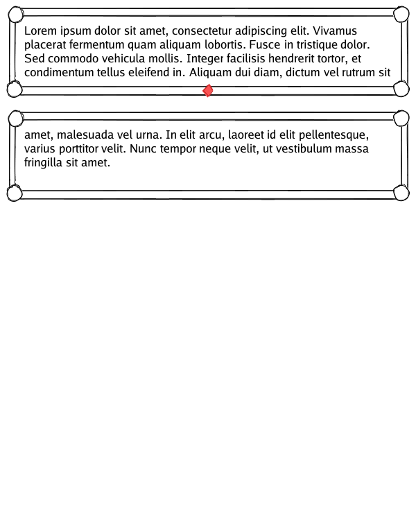 |
| `rpgtextbox.TextEndChevron` | 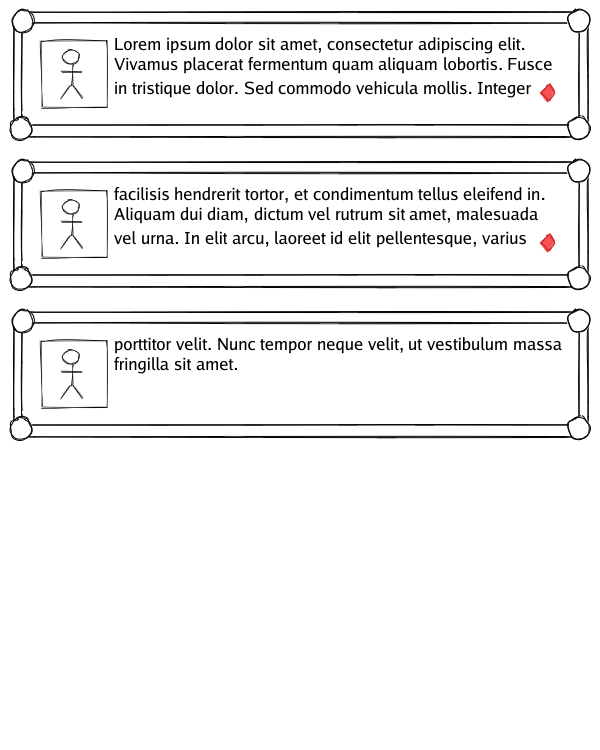 |

## Avatar Location Options

| Option | Example Image |
| --- | --- |
| `rpgtextbox.LeftAvatar` |  |
| `rpgtextbox.RightAvatar` | 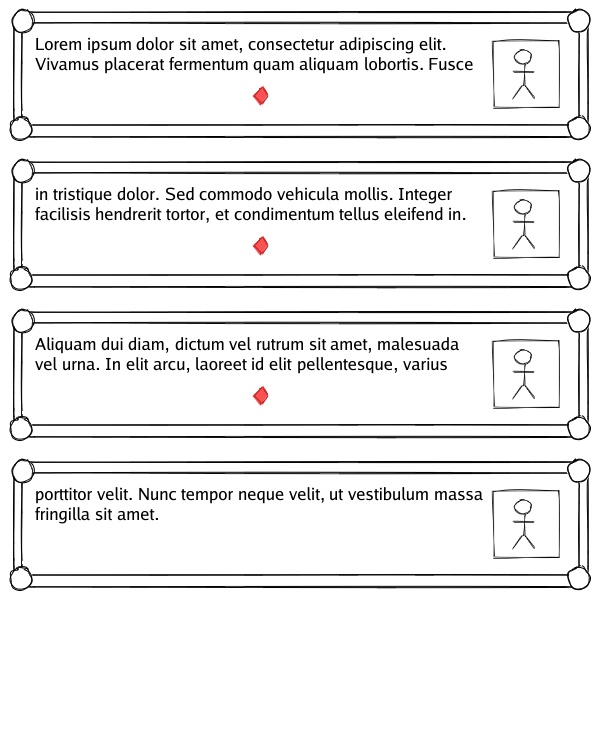 |

## Avatar Scaling Options

| Option | Example Image |
| --- | --- |
| `rpgtextbox.CenterAvatar` | 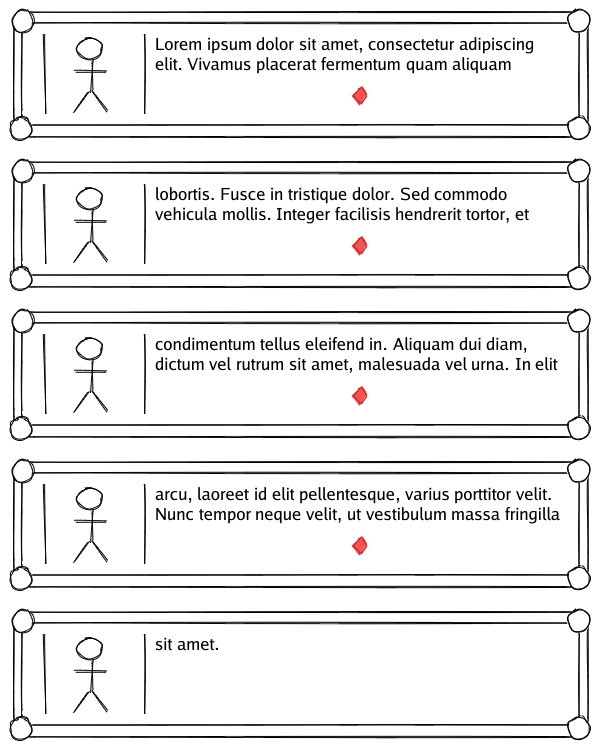 |
| `rpgtextbox.NearestNeighbour` | 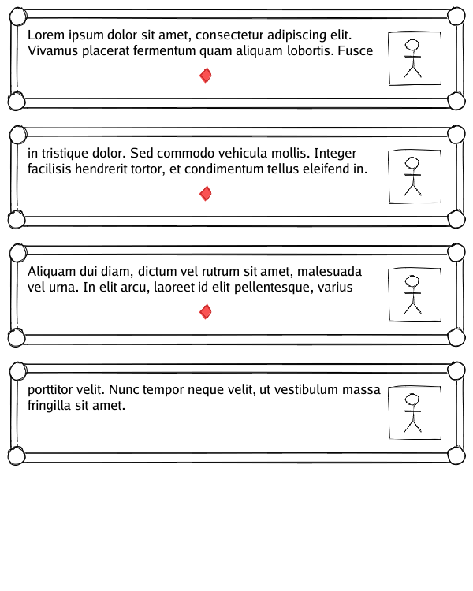 |
| `rpgtextbox.ApproxBiLinear` |  |

## Animation Options

| Option | Example Image |
| --- | --- |
| `rpgtextbox.NewFadeAnimation()` |  |
| `rpgtextbox.NewBoxByBoxAnimation()` |  |
| `rpgtextbox.NewLetterByLetterAnimation()` |  |

## Other options

| Option | Example Image / Description |
| --- | --- |
| `rpgtextbox.Avatar(i image.Image)` | Replace the theme avatar for a special purpose avatar |
| `rpgtextbox.Name(name string)` | Add a character name (TODO) |

# License 

TBH I really haven't thought about it. Contact me
